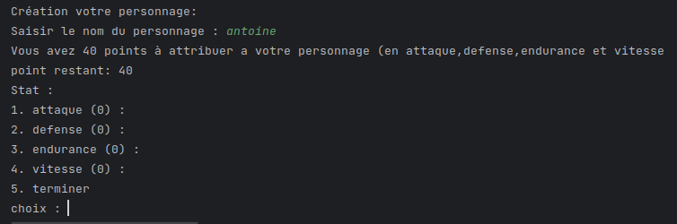
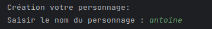
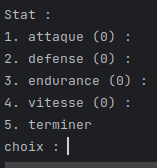
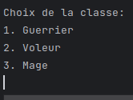
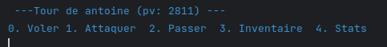
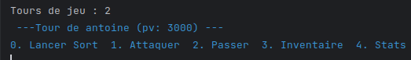
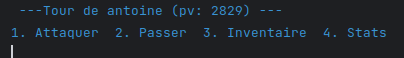
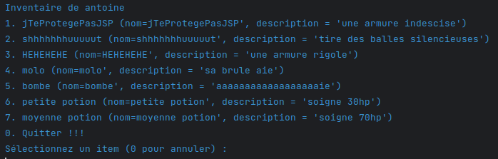
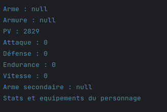

= Compte-rendu Jeu Kotlin
:toc:
== Sommaire

Réalisé par :

- CHONG TOUA Joshua

- Kiusi Luca

- Balcerowiak Antoine

Date début : 26/09/2023

== Contexte

Projet de seconde année
de BTS SIO, le but est de créer KotlinAventure qui est un jeu de rôle
d'aventure qui plonge les joueurs dans un monde fantastique
rempli de monstres redoutables, de personnages héroïques et de combats épiques.
Le jeu se déroule dans un univers médiéval-fantastique où les joueurs incarnent un
personnage.

== Introduction
Pour démarrer le projet, on a récupérer les ressources nécessaire et on s'est répartie
les différentes tâches pour 3 cependant tout le monde a pu toucher au code de chaque mission car nous nous aidions tout au long du projet

== Rendu

Ce Jeu apparait dans la console et il est composé de:

- demande de nom pour le personnage
- demande de choix d'améliorations de statistiques
- demande de choix de classe

Ensuite le jeu ce lance, le combat démarre, et le but est de vaincre tous les adversaires
pour finir le jeu

== Aperçu code

Demande le nom du personnage

----
[...]

print("Saisir le nom du personnage : ")
        val nom = readln()

[...]
----

Choix amélioration de stats
----
[...]

do {
        println("point restant: $points")
        println("Stat : ")
        println("1. attaque ($attaque) : ")
        println("2. defense ($defense) : ")
}

[...]
----

Choix de la classe
----
[...]

println("Choix de la classe: ")
println("1. Guerrier")
println("2. Voleur")
println("3. Mage")
var classe = readln()

[...]
----

== Debut du combat

Interface utilisateur en fonction de sa classe.

- Si le joueur est un voleur, sa capacité "Voler" permet de dérober un des item
de son adversaire de maniere aléatoire.

- Si le joueur est un mage, sa capacité "Lancer Sort" permet d'utiliser un des
sorts qu'il possède dans son grimoire (sort offensif ou sort de soins ).

- Si le joueur est un guerrier, il a la possibilité d'attaquer une deuxième fois
avec son arme secondaire.

----
[...]

if (this.jeu.joueur is Voleur) {
    println("0. Voler 1. Attaquer  2. Passer  3. Inventaire  4. Stats")
}
else if (this.jeu.joueur is Mage) {
    println("0. Lancer Sort  1. Attaquer  2. Passer  3. Inventaire  4. Stats")
}
else
    println("1. Attaquer  2. Passer  3. Inventaire  4. Stats")

[...]
----

- En selectionnant le choix "3", l'inventaire s'ouvre et affiche sous forme de
liste chaque item de l'inventaire.

Methode pour afficher l'inventaire
----
fun ouvrirInventaire(monstre: Personnage): Boolean {
        println("Inventaire de ${this.nom}")

        // Affiche le contenu de l'inventaire avec des numéros d'index pour chaque élément
        for (i in 1 until this.inventaire.size) {
            println("$i. ${this.inventaire[i]}")
        }

        println("0. Quitter !!!")

        // Appelle la fonction selctionInventaire pour sélectionner et effectuer une action depuis l'inventaire
        return selctionInventaire(monstre)
    }
----

- En selectionnant le choix "4", les statistiques, les armes et les armures
équipés s'affichent sous forme de liste.

Méthode pour afficher les statistiques du joueur
----
fun stats() {
        // Affiche l'arme équipée, le cas échéant
        println("Arme : ${this.arme}")

        // Affiche l'armure équipée, le cas échéant
        println("Armure : ${this.armure}")

        // Affiche les points de vie du personnage
        println("PV : ${this.pointDeVie}")

        // Affiche l'attaque du personnage
        println("Attaque : ${this.attaque}")

        // Affiche la défense du personnage
        println("Défense : ${this.defense}")

        // Affiche l'endurance du personnage
        println("Endurance : ${this.endurance}")

        // Affiche la vitesse du personnage
        println("Vitesse : ${this.vitesse}")
----

== Creations des class

Création class Guerrier

[source,kotlin]
----
class Guerrier(
    nom: String,
    pointDeVie: Int,
    pointDeVieMax: Int,
    attaque: Int,
    defense: Int,
    endurance: Int,
    vitesse: Int,
    armure: Armures?,
    arme: Armes?,
    var armeSecondaire: Armes?,
) : Personnage(nom, pointDeVie, pointDeVieMax, attaque, defense, endurance, vitesse, armure = null, arme = null)
----

Création class Mage

[source, kotlin]
----
class Mage (
    nom: String,
    pointDeVie:Int,
    pointDeVieMax: Int,
    attaque: Int,
    defense: Int,
    endurance: Int,
    vitesse: Int,
    armure : Armures?,
    arme : Armes?,
    val grimoire:MutableList<Sort> = mutableListOf<Sort>(),
    ):Personnage(nom,pointDeVie,pointDeVieMax,attaque,defense,endurance,vitesse,armure=null,arme=null,)

----

Création class Sort

[source,kotlin]
----
class Sort(
    val nom: String,
    val effet: (Personnage, Personnage) -> Unit
)
----

Création class Voleur

[source,kotlin]
----
class Voleur (
    nom: String,
    pointDeVie:Int,
    pointDeVieMax: Int,
    attaque: Int,
    defense: Int,
    endurance: Int,
    vitesse: Int,
    armure : Armures?,
    arme : Armes?
    ):Personnage(nom,pointDeVie,pointDeVieMax,attaque,defense,endurance,vitesse,armure=null,arme=null,)

----

Création class mere Item

[source,kotlin]
----
open class Item  (
    val nom : String,
    val description : String)
----
== Armes
Création class fille Arme

[source,kotlin]
----
class Armes (
    name : String,
    description : String,
    val type : TypeArme,
    val qualite : Qualite,

):Item(name,description)
----
Equipe l'arme
----
override fun utiliser(cible: Personnage){
     cible.equipe(this)
}
----
Methode qui calcule les dégats que l'arme infligera
----
fun calculDegats():Int{
    var desDegat = TirageDes(this.type.nombreDes,this.type.valeurDeMax)
    var desCrit = TirageDes(1,20)
    var degats = 0
    if (desCrit.lance()  >= this.type.activationCritique){
        degats = desDegat.lance()*this.type.multiplicateurCritique+this.qualite.bonusQualite
        println("Coup Critique")
    }
    else {
        degats = desDegat.lance()+this.qualite.bonusQualite
    }
    return degats
}
----

== Armures
Création class fille Armure

[source,kotlin]
----
class Armures(
    nom: String,
    description: String,
    val type: TypeArmure,
    val qualite: Qualite
    ):Item(nom,description) {
----
Equipe l'armure
----
override fun utiliser(cible:Personnage) {
        cible.equipe(this)
    }
----
Méthode qui calcule la protection
----
fun calculProtection(): Int {
        return this.type.bonusType + this.qualite.bonusQualite
    }
----

== Bombes
Création class fille Bombe

[source,kotlin]
----
class Bombe constructor(
    val nombreDeDes :Int,
    val maxDe :Int,
     nom :String,
     description :String
):Item(nom,description){
----

Méthode utiliser() lance une bombe sur l'adversaire
----
override fun utiliser(cible : Personnage){
        var protec = 0
        val des = jeu.TirageDes(nombreDeDes , maxDe)
        var degats = des.lance()
        if (cible.armure != null) {
            protec = cible.armure!!.calculProtection()
        }
        degats -= protec
        if (degats<1)
            degats = 1
        cible.pointDeVie -= degats
        println("la $nom inflige $degats dégats a ${cible.nom}")
    }
----

== Potions

Création class fille Potion

[source,kotlin]
----
class Potions constructor(
    val soin :Int,
    nom :String,
    description :String): Item(nom, description){
----
Méthode utiliser() boit une potion
----
override fun utiliser (cible: Personnage){
         cible.boirePotion()
    }
----
Détail de la méthode boirePotion()
----
fun boirePotion() {
        // Vérifie si le personnage a au moins une potion dans son inventaire
        if (avoirPotion()) {
            // Parcourt l'inventaire du personnage
            for (elt in inventaire) {
                // Vérifie si l'élément est une potion
                if (elt is item.Potions) {
                    pointDeVie += elt.soin
                    // Si les points de vie dépassent le maximum, les ajuste au maximum
                    if (pointDeVie > pointDeVieMax) {
                        pointDeVie = pointDeVieMax
                    }
                }
            }
        }
    }
----

== Problèmes rencontrés

Tout au long de ce projet, on a pu rencontrer un problème :

- les droits avec Code with me, car seul l'hote possedait les droits pour réaliser des tests

== Conclusion

Pour conclure, ce projet a apporté que des points positifs à notre formation car il nous a permis de découvrir un nouveau language (Kotlin)
et de nous améliorer dans la Programmation Orientée Objet (POO).
Si le projet était à refaire, nous nous concentrerons en premier sur la creation de class. 
Pour améliorer le projet, la création d'un mode un contre un pourrait améliorer le projet.

== Lien

Lien github: https://github.com/Antoine-Balcerowiak/ProjetJeuxDeRole.git

